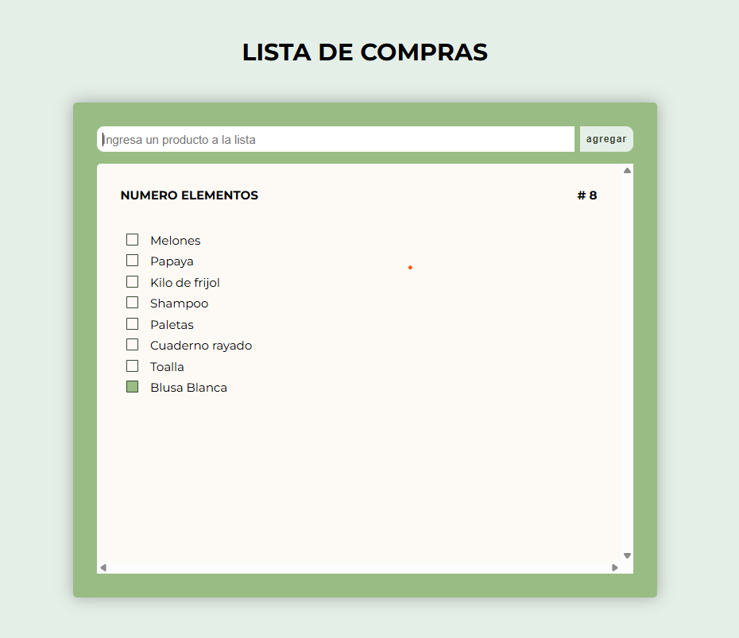

# Logica y Algoritmos

En este repositorio se iran subiendo las actividades realizadas en DEV.F del programa de Becalos.

## Dependencias
* Node Js v22.11.0
### Clase 1. [Introduccion a EMACScripts](https://github.com/MLuisaGP/Becalos-logicaYAlgoritmos/tree/main/clase_1)

En esta primera clase se da la introduccion del estandar EMAC y vemos como ha evolucionado al paso de los tiempos. El principal objetivo del tema es aplicar los estandares establecidos por EMACScripts(6) y entender las ventajas de seguir este estandar y evitar utilizar acciones tradicionales o absoletas. Se menciona la implementacion del let y const en lugar del var, como var es un tipo de variable que provoca dificultad en mantener el codigo facil de leer y sin errores, el uso de funciones de flecha en lugar de funciones tradicionales, la implementación de clases y de modulos, como otras cosas más.
En esta clase se tiene las notas realizadas dentro de la clase en vivo que podemos verlas en [clase_1: NotasClases](https://github.com/MLuisaGP/Becalos-logicaYAlgoritmos/tree/main/clase_1/notasClase)
Como practica, el cual se encuentra en [clase_1: proyecto](https://github.com/MLuisaGP/Becalos-logicaYAlgoritmos/tree/main/clase_1/proyecto) de la clase consistia en actualizar un codigo que se encontraba con estandares anteriores a EMACScripts(6) y actualizarlo con el estandar EMACScripts(6). El codigo consitia en una aplicaciones para generar un intinerario de viajes. 
Para poder correr el codigo basta con descargar el repositorio que se encuentra en el siguiente link o escribir el siguiente codigo en la terminal

        git clone git@github.com:MLuisaGP/Becalos-logicaYAlgoritmos.git

Despues posicionarnos en la carpeta generada y entrar a la carpeta de clase_1/proyecto y correr el archivo:

        cd tempCodeRunnerFile/clase_1/proyecto
        node "./tempCodeRunnerFile/clase_1/proyectotempCodeRunnerFile.js"
        
Te debe de dar el siguiente resultado 

        Destino: Paris
        Fecha: 2024-06-15
        Transporte: Avión
        Personas: 1
        Costo: $700
        ---------------------------
        Destino: Londres
        Fecha: 2024-07-01
        Transporte: Tren
        Personas: 4
        Costo: $1400
        ---------------------------
        Destino: Brazil
        Fecha: 2024-07-01
        Transporte: Jet
        Personas: 3
        Costo: $1800

### Clase 2. [Estructuras de Datos](https://github.com/MLuisaGP/Becalos-logicaYAlgoritmos/tree/main/clase_2)

En esta lesión se dio un repaso de lo que es array y se dio introducción a diferentes estructuras de datos, dando ejemplos en que momento utilizrlos, toda la información aprendida en clase se puede ver en la carpeta[clase_2: NotasClases](https://github.com/MLuisaGP/Becalos-logicaYAlgoritmos/tree/main/clase_2/notasClase)
Como practica, el cual se encuentra en [clase_2: proyecto](https://github.com/MLuisaGP/Becalos-logicaYAlgoritmos/tree/main/clase_2/proyecto) consiste en crear una programa de lista de compras utilizando las estructuras de datos correspondientes. En este caso se dio uso de la estructura de datos conjuntos [ SET ], ya que nos permite almacenar una lista de elementos que no se repiten. Para esto se dio uso del metodo remove para remover elementos, add para agregar un elemento a la lista si aun no habia estado agregado, y size para obtener la cantidad de elementos dentro de la lista. Se le agrego un diseño frontend con el proposito de aplicar los conocimientos anteriores permitiendo reforzarlos mienstras se realiza los requerimientos de la practica.
Se agregan agregan elementos mediante el input text y haciendo click en el boton agregar(o dar enter). Cada vez que se agrege un nuevo elemento se imprimira la lista con el nuevo elemento y el numero de elementos ira cambiando. Para quitar un elemento de la lista, se hace click en el elemento y este sera removido de la lista y esta se mostrara de nuevo. No mostrara elementos vacios, repetidos.
El proyecto se puede ver en producion con el siguiente link [Proyecto_2](https://mluisagp.github.io/Becalos-logicaYAlgoritmos/clase_2/proyecto/)
Teniendo como resultado final la vista que se muestra en la siguiente imagen.

### Clase 3. [Metodos de Arreglos](https://github.com/MLuisaGP/Becalos-logicaYAlgoritmos/tree/main/clase_3)

En esta clase se vieron los diferentes metodos de arreglos a un nivel más profundo y se vieron los casos de uso en que se utilizaria cada metodo. Los ejercicios realizados en clase se puede ver en el siguiente link [clase_3: NotasClases](https://github.com/MLuisaGP/Becalos-logicaYAlgoritmos/tree/main/clase_3/notas-clase) y los ejercicos de las lecturas con anotaciones relevantes se pueden ver en el siguiente link  [clase_3: lectura](https://github.com/MLuisaGP/Becalos-logicaYAlgoritmos/tree/main/clase_3/lectura)
Como actividad de practica, se plnea gestionar los datos dentro de una tienda online, donde se tiene un listado de productos con información como nombre, precio y categoría. El proposito principal de la actividad es filtrar los productos por precio, ordenarlos alfabéticamente y generar una lista con los nombres. Esta actividad se puede ver en el siguiente link 
[Metodos de Arreglos](https://github.com/MLuisaGP/Becalos-logicaYAlgoritmos/tree/main/clase_3/proyecto/js/practica.js). 
Las acciones que se realizan son los siguientes:

- Se obtiene los productos que sean menores de 100 pesos.
- Productos ordenados de manera ascendente.
- Lista de nombres de los productos.
- Precio total de todos los productos.
- Si hay al menos un producto de electronica, entonces hay descuento.
- Verificar si todos tienen envio gratis.
- Validar si hay productos sin stock.
- Y se agrego tambien como extra, como seria enviar productos a un carrito, donde no se quiere insertar dos veces el producto y que mejor se agrege una propiedad extra con el nombre cantidad.

La practica final nos da el siguiente resultado en la terminal:

        Los productos menores a 100 pesos son: [
        {
        id: 12930,
        nombre: 'Camiseta',
        precio: 15,
        categoria: 'Ropa',
        img: 'img/camiseta.avif',
        free_delivery: false,
        stock: 10
        },
        {
        id: 12321,
        nombre: 'Libro',
        precio: 12,
        categoria: 'Educacion',
        img: 'img/libro.jpg',
        free_delivery: false,
        stock: 10
        },
        {
        id: 54261,
        nombre: 'Zapatos',
        precio: 50,
        categoria: 'Ropa',
        img: 'img/telefono.png',
        free_delivery: false,
        stock: 5
        }
        ]
        Productos ordenados de manera asc: [
        {
        id: 12930,
        nombre: 'Camiseta',
        precio: 15,
        categoria: 'Ropa',
        img: 'img/camiseta.avif',
        free_delivery: false,
        stock: 10
        },
        {
        id: 66533,
        nombre: 'Celular',
        precio: 600,
        categoria: 'Electronica',
        img: 'img/zapatos.webp',
        free_delivery: true,
        stock: 0
        },
        {
        id: 43241,
        nombre: 'Laptop',
        precio: 800,
        categoria: 'Electronica',
        img: 'img/laptop.png',
        free_delivery: true,
        stock: 0
        },
        {
        id: 12321,
        nombre: 'Libro',
        precio: 12,
        categoria: 'Educacion',
        img: 'img/libro.jpg',
        free_delivery: false,
        stock: 10
        },
        {
        id: 54261,
        nombre: 'Zapatos',
        precio: 50,
        categoria: 'Ropa',
        img: 'img/telefono.png',
        free_delivery: false,
        stock: 5
        }
        ]
        Productos: [ 'Camiseta', 'Celular', 'Laptop', 'Libro', 'Zapatos' ]
        Precio total 1477
        Hay descuento?  true
        Tienen todos envio gratis?  false
        Hay productos sin stock? true
        carrito: [
        {
        id: 12930,
        nombre: 'Camiseta',
        precio: 15,
        categoria: 'Ropa',
        img: 'img/camiseta.avif',
        free_delivery: false,
        stock: 10,
        cantidad: 2
        },
        {
        id: 43241,
        nombre: 'Laptop',
        precio: 800,
        categoria: 'Electronica',
        img: 'img/laptop.png',
        free_delivery: true,
        stock: 0,
        cantidad: 1
        }
        ]

### Clase 4. [Algoritmo de los 2 punteros](https://github.com/MLuisaGP/Becalos-logicaYAlgoritmos/tree/main/clase_4)

En esta leccion se vio el metodo de los dos punteros. El método de los dos punteros es una técnica esencial en algoritmos y estructuras de datos que se emplea frecuentemente para recorrer un arreglo de manera optimizada. Se aplica en distintas situaciones, como la identificación de pares de números que satisfacen ciertas condiciones, la combinación de listas ordenadas o la resolución de problemas vinculados con secuencias y cadenas de caracteres.
Las notas relacionadas a la clase se pueden ver en el siguiente link [clase_4: NotasClases](https://github.com/MLuisaGP/Becalos-logicaYAlgoritmos/tree/main/clase_4/notas_clase)

Como practica, el cual se encuentra en [clase_3: practica](https://github.com/MLuisaGP/Becalos-logicaYAlgoritmos/tree/main/clase_4/practica/app.js). El cual consiste en utilizar el algoritmo de dos punteros para obtener el primer par de personas que tengan igual su primera inicial de su nombre, con el poposito de organizar las mesas de los invitados, sentando a algunas personas con la misma inicial juntas. La respuesta en consola se puede ver a continuación.

        [ 'Maria', 'Monica' ]

## Autor

Creado por [MluisaGP](https://github.com/MLuisaGP)

Este proyecto fue hecho gracias al apoyo de Becalos, con la beca de Tech Challenge
